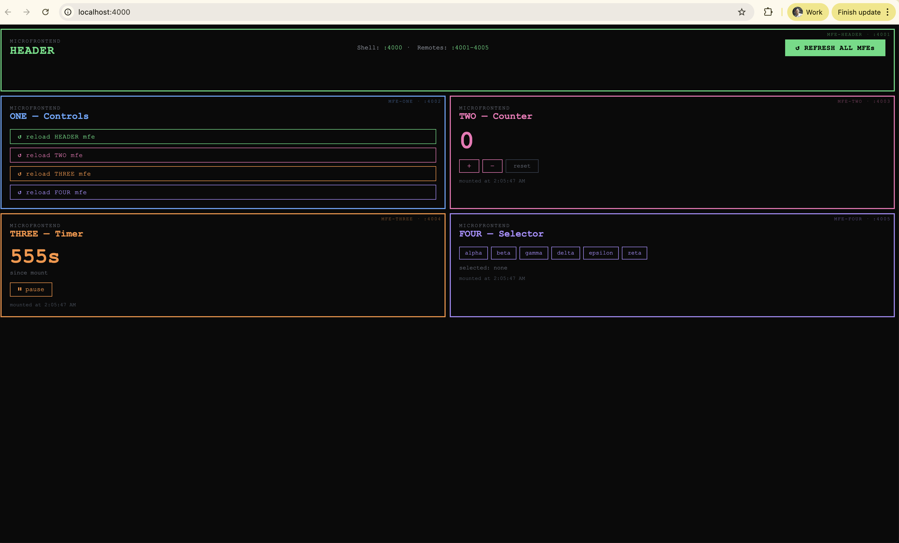
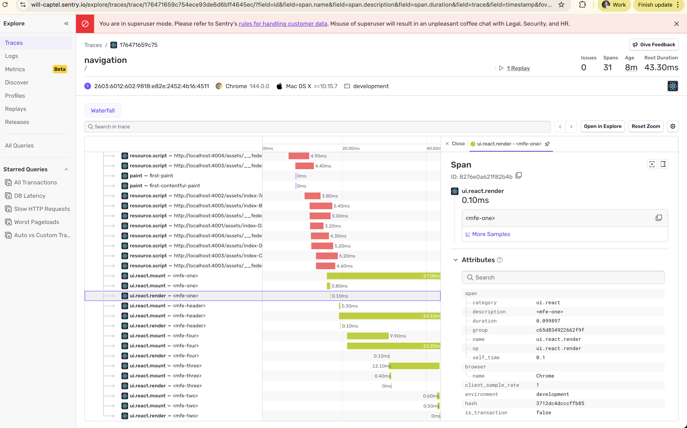
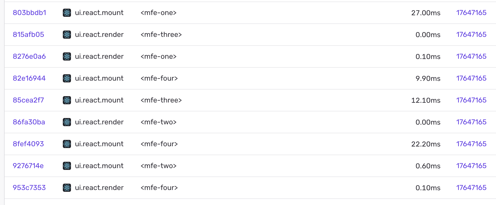

# mfe-what

5-MFE microfrontend monorepo — React + Vite + pnpm + Nx + Module Federation + Sentry



<div>
  
  
</div>

## Layout

```
┌─────────────────────────────────────────────────┐
│  mfe-header  (:4001)   [ ↺ REFRESH ALL MFEs ]   │
└─────────────────────────────────────────────────┘
┌──────────────────────┬──────────────────────────┐
│  mfe-one  (:4002)    │  mfe-two  (:4003)        │
│  Controls            │  Counter                 │
│  [reload HEADER]     │                          │
│  [reload TWO]        │                          │
│  [reload THREE]      │                          │
│  [reload FOUR]       │                          │
├──────────────────────┼──────────────────────────┤
│  mfe-three (:4004)   │  mfe-four (:4005)        │
│  Timer               │  Selector                │
└──────────────────────┴──────────────────────────┘
Shell: http://localhost:4000
```

## Ports

| App        | Port |
|------------|------|
| shell      | 4000 |
| mfe-header | 4001 |
| mfe-one    | 4002 |
| mfe-two    | 4003 |
| mfe-three  | 4004 |
| mfe-four   | 4005 |

## Sentry setup

1. Copy `.env.example` to `.env` in `apps/shell/`
2. Paste your Sentry DSN as `VITE_SENTRY_DSN`

```bash
cp apps/shell/.env.example apps/shell/.env
# edit apps/shell/.env
```

## Running

The remotes must be **built** before the shell can load them via Module Federation.
`start.sh` handles this automatically:

```bash
pnpm dev          # build remotes → preview remotes → start shell dev server
```

Or manually:

```bash
# 1. Build all remotes
pnpm build:remotes

# 2. Start remote preview servers + shell dev server (in separate terminals or via concurrently)
pnpm start:remotes   # runs all 5 remotes on their ports
pnpm start:shell     # runs shell at :4000
```

## Nx commands

```bash
# Build everything
pnpm build

# Build only remotes
pnpm build:remotes

# Run a specific app
./node_modules/.bin/nx run mfe-two:serve
./node_modules/.bin/nx run shell:serve

# See the project graph
./node_modules/.bin/nx graph
```

## Architecture

- **Module Federation** via `@originjs/vite-plugin-federation` — each remote exposes `./App`
- **Shell** manages MFE keys (`useState`) — bumping a key remounts (re-fetches) the remote
- **Sentry** initialized in `apps/shell/src/main.tsx`:
  - `reactRouterV6BrowserTracingIntegration` — traces navigation
  - `replayIntegration` — session replay
  - `Sentry.withProfiler(App)` — component profiling
  - `Sentry.ErrorBoundary` — wraps each remote, reports errors
  - `Sentry.addBreadcrumb` — fires on every MFE refresh action

---

## Why spans from all 5 microfrontends appear in a single trace and a single Project in Sentry

Each MFE has its own `SENTRY_DSN` configured, but in practice all spans end up under one trace and are sent to one Sentry project. This is by design in the browser SDK, not a bug or misconfiguration.

### One browser context, one Sentry client, one active trace

Module Federation loads all 5 MFE bundles into the **same browser window and JavaScript runtime**. Only the shell calls `Sentry.init()`, which creates a single Sentry client attached to `window.__SENTRY__`. All MFEs inherit this client — they have no init call of their own and no way to register a separate one in the same browsing context.

When the page loads, `reactRouterV6BrowserTracingIntegration` creates exactly **one root span** with one `trace_id`:

- A `pageload` span — starts immediately at page load
- A `navigation` span — created on each route change

That's it. All 5 MFEs render as children of whichever root span is active. Their component render spans, HTTP spans, and any other auto-instrumented spans all share the same `trace_id` and get bundled into the same transaction envelope, which is sent to the shell's DSN.

The browser SDK was designed around the single-app model. There is no API to maintain 5 concurrent root spans with a single `Sentry.init()`.

### Why errors route correctly but spans do not

Error events route to the correct MFE project because `@sentry/vite-plugin` injects `moduleMetadata` (including the MFE's DSN) into each MFE's compiled JavaScript bundle at build time. When an error is thrown inside an MFE, the stack frames reference that MFE's code, and the shell's `makeMultiplexedTransport` walks those frames to find the DSN and routes the error accordingly.

Spans have no stack frames and no `moduleMetadata`. A `pageload` or `navigation` transaction contains spans from all 5 MFEs interleaved, and there is nothing in the span data to identify which MFE "owns" it. The transport has no signal to route by, so the transaction falls through to the shell's fallback DSN.

### What was attempted and why it did not work

`Sentry.setTag('mfe_dsn', dsn)` was added to each MFE's root component via a `useEffect`, with the transport extended to read that tag off the transaction event and route to the corresponding DSN.

This failed for two reasons:

1. **Race condition.** All 5 MFEs mount during the same render cycle. Each one's `useEffect` fires and calls `setTag`, overwriting the previous value on the shared global scope. The last MFE to mount wins — which is why the `navigation` transaction appeared under `mfe-four` rather than consistently routing to any one MFE.

2. **Timing of the pageload transaction.** The `pageload` transaction starts immediately at page load and finishes before most `useEffect`s have fired. By the time any MFE sets `mfe_dsn`, the pageload envelope has already been assembled and queued, so it never picks up the tag and falls through to the shell's DSN.

### The actual constraint

The browser SDK maintains **one active trace per browsing context**. To get truly separate traces and separate Sentry projects per MFE, each MFE would need its own isolated browsing context (e.g. an iframe) or its own `BrowserClient` instance with fully custom, manual span instrumentation — neither of which is compatible with standard Module Federation auto-instrumentation.

### What this repo does instead

Errors are routed per-MFE project via `module_metadata` + `makeMultiplexedTransport` (works correctly). Spans all go to the shell's project as a single shared trace. The `mfe.name` span attribute set in `withMfeTag` (see `apps/shell/src/App.tsx`) allows filtering spans by MFE within that trace in the Sentry UI using `mfe.name:mfe-two`.
